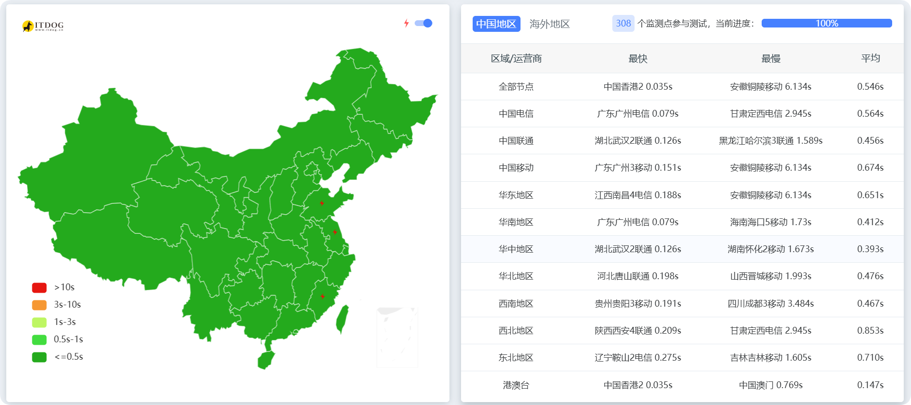
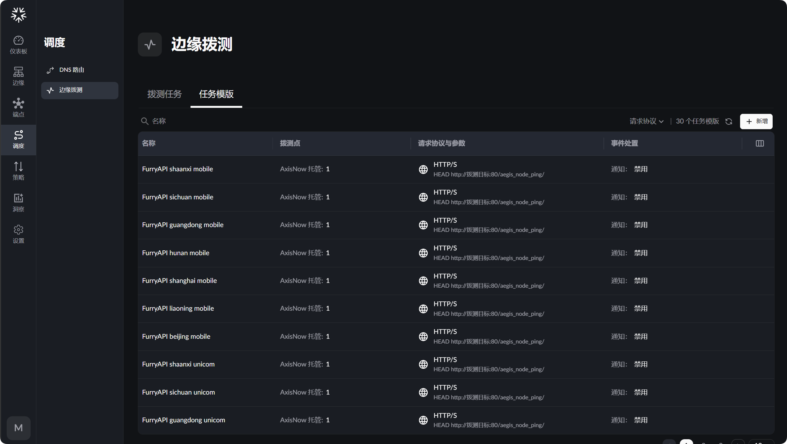
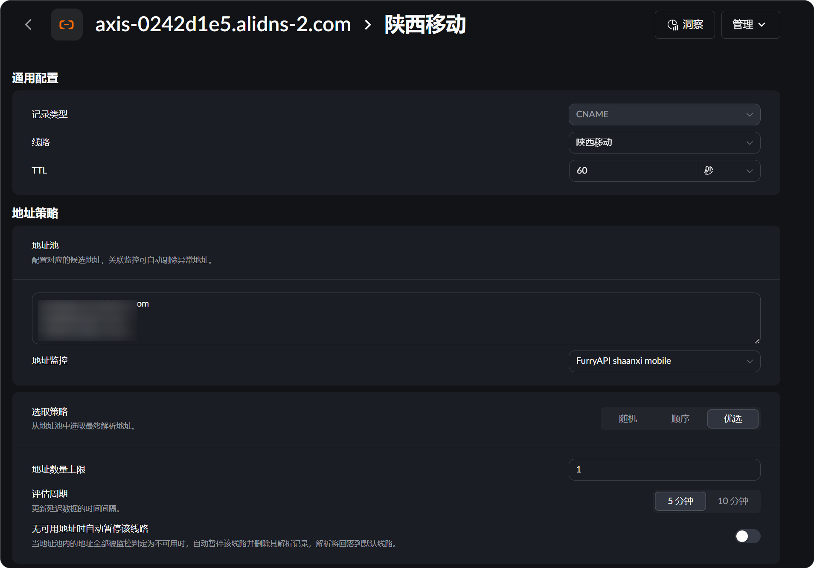

## 前情提要

第一次了解到[AxisNow](https://www.axisnow.io/)是在某著名科技论坛上2025年9月，在当时就注册了账号也算是个老用户了（）
[AxisNow](https://www.axisnow.io/)具有很高的可玩性，他可以自己搭建边缘节点，订阅、使用他人的边缘节点等等，同时还附带有一些其他商家收费的功能，比如定时拨测、自动dns切换、优选等等，~~以前官方还自称为小cf~~

## 准备工作

利用AxisNow获取 [furryapi](https://api.furry.ist/?ref=blog) 同款的CDN，你需要准备的是：

	1.一个AxisNow账号
	2.一个域名
	3.在AxisNow的控制台内，边缘-提供商 内订阅好准备使用的提供商，在AxisNow的市场里有免费提供的供应商

 > 也可以使用如下的邀请码
 > ```text
 > WL0TRIBA
 > T8Q15CAM
 > QRHH4RIP
 > MKESV3QY
 > VTYWQZZK
 > O5X9JMOJ
 > DLXI5ZOC
 > ```



### 正式操作

#### 简单版

 1.在你自己的域名dns服务商添加CNAME，CNAME到`axis-0242d1e5.alidns-2.com`
 > `axis-0242d1e5.alidns-2.com`是我已经配置完可使用的CNAME
 
 2.前往AxisNow控制台 -> 域 -> 新增 添加你自己的域名，记得先完成cname配置或者在设置-> DNS提供商 处添加好服务商秘钥，不然**无法签发SSL证书**
 
 3.完成添加之后，前往策略->插件，进行你需要的修改，此处每个人都不一样，不过一般都是打开下强制HTTPS之类的或者自定义一下安全配置
 
 4.enjoy

#### 自配值版本

> 自行配置带有一定的难度和复杂性

 1.前往 调度->边缘拨测->任务模板 为你想要的地区（此处地区和运营商越多后面优选效果越好）创建拨测模版，故障条件等按照业务实际情况配置
 

2.前往 调度->DNS路由->新增 创建个优选用的调度DNS域名，并且为各个地区的拨测创建、绑定对应地区的模版，地址池填写订阅的服务商的cname，此处越多运营商越多地区效果越好，注意要创建一个兜底默认规则，避免出现无任何匹配或者dns返回的情况，选取策略使用优选就会自动选择最好效果的cname


3.将域名解析到你创建的CNAME域名，然后Enjoy (*^▽^*)

### 原理&解析

AxisNow支持自动拨测和多节点自动选择最佳线路，以及分流dns，结合这些功能，我们就能够做到让不同的地区访问不同的cdn节点，比如广州dns会返回香港，但是内陆却会返回新加坡或者俄罗斯，以达到分地区加速和自动选择最优线路的目的，这些还都是在AxisNow免费范围内实现的！

### 碎碎念

最近突然想起来好久没有更新我的博客了，所以觉得凑一篇文章出来，我会尝试周更的...
尽量吧